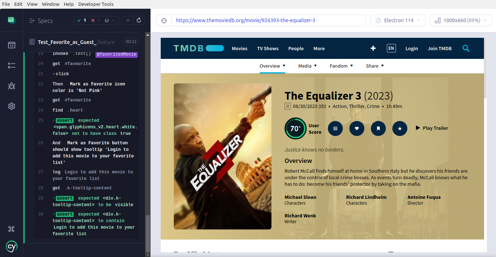
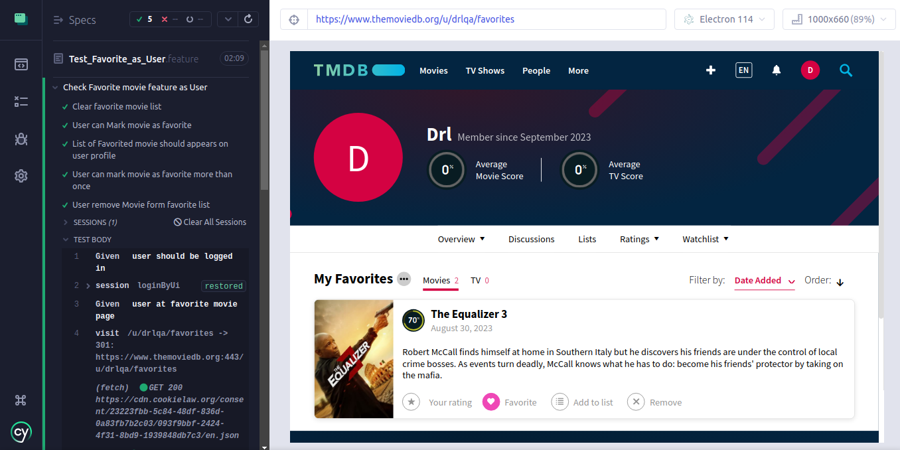
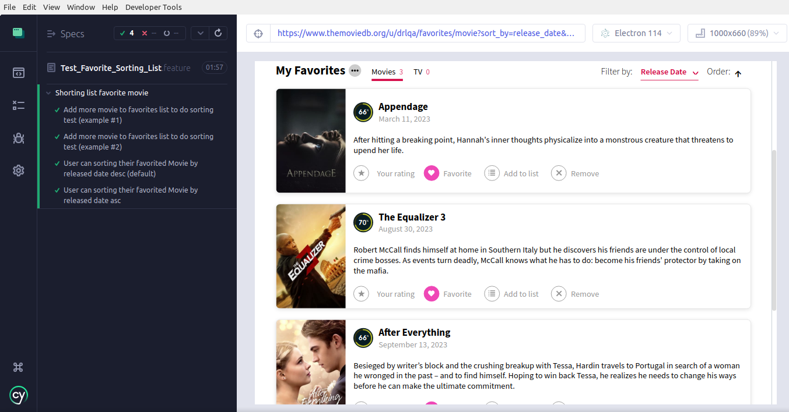

# Cypress Automation Favorite Movie versi BDD Cucumber (Gherkin)

Mencoba implementasi gherkin pada automation Favorite Movie using cypress


## How To Install

Pastikan nodejs terinstall pada komputer

- open terminal/cmd

```
- npm install
```

- change env configuration on cypress.config.js
```
...
env: {
    username: '', //isi sesuai akun imdb anda
    password: ''
  },
...
```
```
- npx cypress open
```
- run Test_Favorite_as_Guest.feature
- run Test_Favorite_as_User.feature
- run Test_Favorite_Sorting_List.feature
- enjoy :)

## Test Result

Test_Favorite_as_Guest.feature


Test_Favorite_as_User.feature


Test_Favorite_Sorting_List.feature



## Covered Test Scenario 

### Add/Remove Favorite Movie
- User can mark movie as favorite
- Favorited movie should exist on user profile
- User can't mark as favorite without logged in
- User can mark movie as favorite more than once
- User can remove favorite movie from their profile

### Order Favorite Movie
- User can sorting their favorited Movie by Released Date (default desc)
- User can sorting their favorited Movie by Released Date asc


## NOTE
This project use nodejs v16.13.2 and cypress v13.2.0

Tested on Electron browser v114

Thanks


